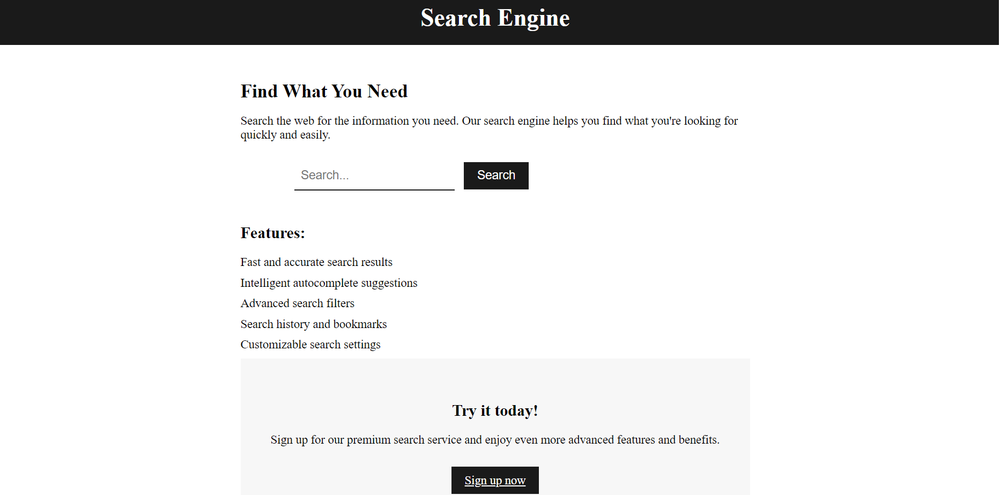

# Image Scraping with Beautiful Soup

In this project, we use the Beautiful Soup library to scrape images from a website. Beautiful Soup is a Python library that makes it easy to scrape data from HTML and XML documents.

### Objective

The objective of this project is to demonstrate how to use Beautiful Soup to scrape images from a website and store them in a database.

### Goal 

Our goal is to show how web scraping can be used to collect large amounts of data from the web, and how this data can be stored in a database for further analysis or use.
<br>

#### __Tools Used :__

* __Python 3__
* __Beautiful Soup__
* __MongoDB Atlas__

## How to Scrape Images Using Beautiful Soup

First, we need to import the necessary libraries: requests and Beautiful Soup.

```python

from bs4 import BeautifulSoup
import requests

```

2. Send an HTTP request to the URL of the webpage you want to access. <br>

```python
url = 'https://example.com'
response = requests.get(url)
```

3. Parse the HTML content of the page using BeautifulSoup. <br>

```python
soup = BeautifulSoup(response.content, 'html.parser')
```

4.  Finally, we can loop through the images and extract the source URLs.

```python
image_urls = []
for image in images:
    src = image.get('src')
    image_urls.append(src)

```

<br>

## How to Insert Data into MongoDB Atlas

MongoDB Atlas is a cloud-based database service that allows you to store and manage your data in a highly scalable and secure environment. Here are three different methods to insert data into MongoDB Atlas:

### Method 1: Using the MongoDB Shell

Connect to your MongoDB Atlas cluster using the MongoDB shell.

```bash
mongo "mongodb+srv://<username>:<password>@<clustername>.mongodb.net/test" --username <username>
```

2. Switch to the database where you want to insert the data.
```bash
use <database_name>
```
3. Insert the data into the database using the insertOne() or insertMany() methods.
```bash
db.<collection_name>.insertOne({ "key": "value" })
```

### Method 2: Using the MongoDB Compass GUI

1. Open MongoDB Compass and connect to your MongoDB Atlas cluster.

2. Click the "Create Database" button to create a new database.

3. Click the "Create Collection" button to create a new collection.

4. Click the "Insert Document" button to insert a new document.

Enter the data you want to insert into the document fields.

Method 3: Using the pymongo Python Driver

1. Install the pymongo Python package.

```python
pip install pymongo
```

2. Import the pymongo library and connect to your MongoDB Atlas cluster.
```python
import pymongo
client = pymongo.MongoClient("mongodb+srv://<username>:<password>@<clustername>.mongodb.net/test")
db = client.<database_name>
```

4. Insert the data into the database using the insert_one() or insert_many() methods.
```python
db.<collection_name>.insert_one({ "key": "value" })
```

Check my __app.py__ for better understanding of Image/webscarping through beautifulsoup library.
<br>

### UI/UX Design 


<br>


<br>
### AUTHOR
<hr>
<strong>Shehryar Gondal</strong>


You can get in touch with me on my LinkedIn Profile:<br>
 <a href = "https://linkedin.com/in/shehryar-gondal-data-analyst"></a>

You can also follow my GitHub Profile to stay updated about my latest projects:<br>
<a href = "https://github.com/ShehryarGondal1"></a>


If you liked the repo then kindly support it by giving it a star ⭐.
